# OpenMPI - Radix Sort
## IF3230 Sistem Paralel dan Terdistribusi


#### [Petunjuk Penggunaan Program]
##### Penggunaan Program di Server
1. Login dengan ssh ke 10.5.32.14
2. Clone repository terlebih dahulu
3. Masuk pada directory repository tersebut
4. Ketik **make** pada terminal
5. Jalankan program dengan mengetik:
```
mpirun --hostfile src/mpi_host.txt -q -np <P> build/radix_sort <N> <B>
```
 Dengan P adalah jumlah processor, N adalah jumlah elemen pada array, dan B adalah jumlah block yang digunakan.

6. Hasil lamanya waktu pengerjaan sorting akan ditampilkan pada layar

##### Penggunaan Program di Local
1. Clone repository terlebih dahulu
2. Buka terminal
3. Masuk pada directory repository tersebut
4. Ketik **make** pada terminal
5. Jalankan program dengan mengetik:
```
mpiexec -np <P> build/radix_sort <N> <B>
```
Dengan P adalah jumlah processor, N adalah jumlah elemen pada array, dan B adalah jumlah block yang digunakan.

6. Hasil lamanya waktu pengerjaan sorting akan ditampilkan pada layar

#### [Pembagian Tugas]
##### Jessin - 13516112
Program & Laporan
##### Nella - 13516025
Program & Laporan

#### [Laporan Pengerjaan]
##### I. Solusi Paralel
Dalam melakukan sort, kami menggunakan 2 buat array. Yaitu array **unsorted** dan **sorted**. Unsorted digunakan untuk menyimpan array yang belum diurutkan, sedangkan yang sorted digunakan untuk menyimpan array yang telah diurutkan.

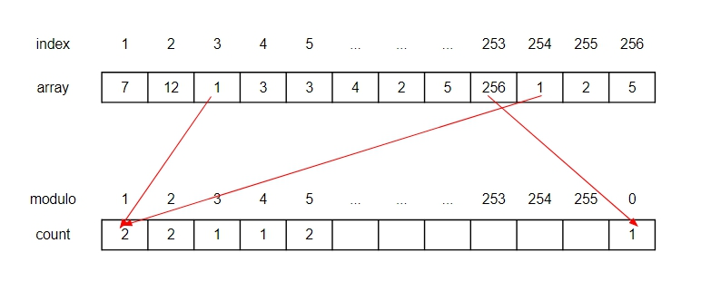

Radix sort yang kelompok kami buat menggunakan basis 2^8 = 256. 8 merupakan representasi dari jumlah bit yang digunakan. Untuk tiap angka, akan di modulo 256 dan kemudian di _sort_ menggunakan **Count Sort**.

**Count Sort** inilah yang akan dilakukan secara paralel.

Count Sort dilakukan sebanyak 4 kali karena terdapat 32 bit dalam integer, dan dalam satu iterasi Radix Sort, menggunakan 8 bit. Untuk iterasi ke-i, angka akan dibagi dengan 256^i.

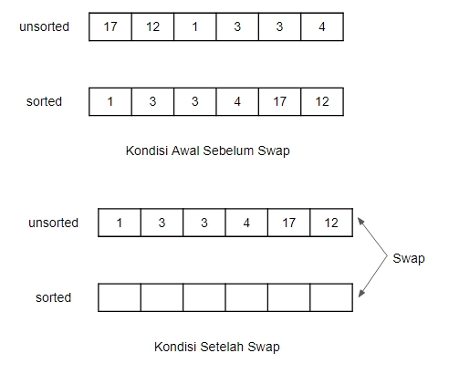

Dalam melakukan perulangan sort, array yang ditampung dalam **sorted array**, diswap dan disimpan dalam **unsorted array** agar tidak boros menggunakan memori.

##### II. Analisis Solusi
Dari solusi Radix Sort yang kami buat, bagian yang dapat diparalelkan hanya bagian komputasi pada *processor* (*Count Sort*) sehingga hasil serial maupun paralel tidak berbeda jauh dan bahkan kemungkinan besar hasil paralel lebih lama karena beban yang dilakukan untuk memproses bertambah.

Berbeda hal jika array yang diperlu di *sort* merupakan hasil baca dari file external (seperti csv). Apabila dilakukan secara paralel, maka hasilnya lebih cepat karena melakukan paralelisasi terhadap proses I/O.

Dari solusi permasalahan radix sort yang dibuat oleh kelompok kami secara paralel, tidak ada solusi lain yang lebih optimal.

##### III. Jumlah Thread
Thread yang digunakan untuk uji coba sebanyak 4 dan 8. Dengan menggunakan berbagai varian jumlah thread, diharapkan dapat digunakan untuk menganalisa kinerja paralelisme juga thread mana yang lebih baik digunakan.

Setelah dilakukan analisa, thread yang optimal untuk digunakan sebanyak 8. Hal ini karena server menggunakan 4 core. Sedangkan by default, mesin yang digunakan menggunakan *multicore* dan *hyperthread* sehingga total thread sebanyak 8.

##### IV. Pengukuran Kinerja
| N | Block | Serial | Paralel np 4 | Paralel np 8
|----------|-----------|---------|-----------|-----------|
| 5000 | 8 | 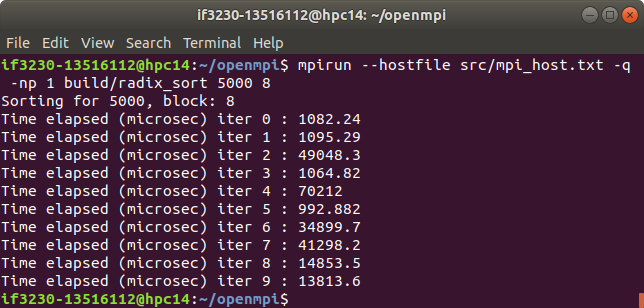 |  |  |
|50000 | 8 | 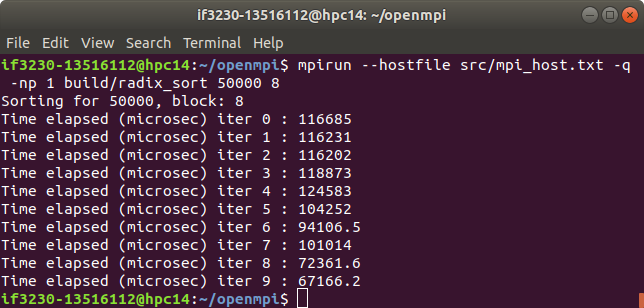 | 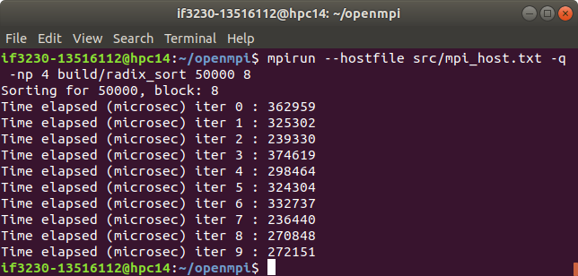 | 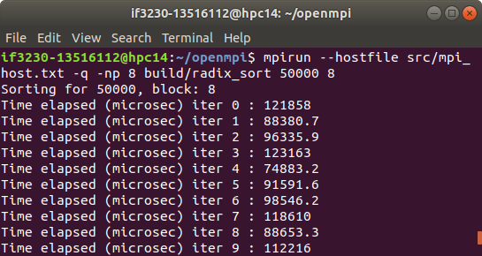 |
| 100000 | 8 | 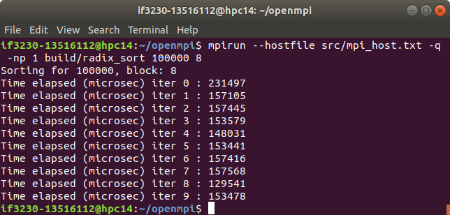 | 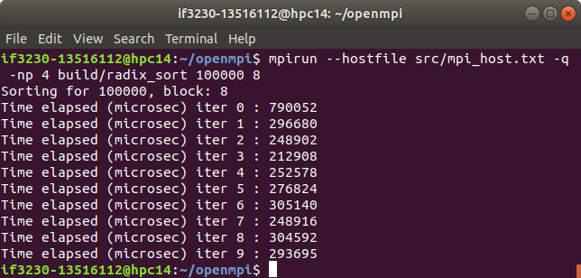 | 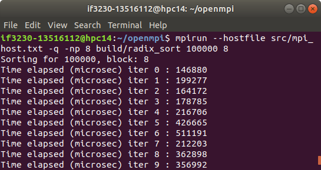 |
|200000 | 8 |  | 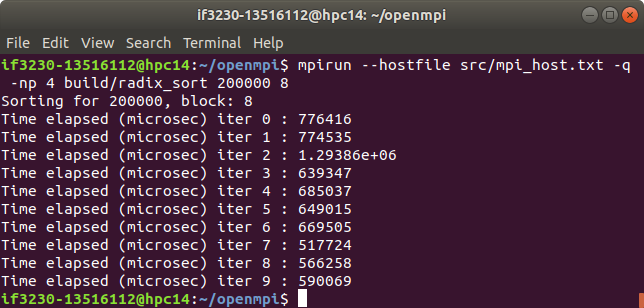 | 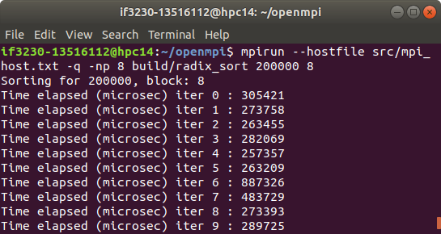 |
|400000 | 8 | 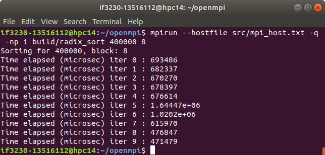 | 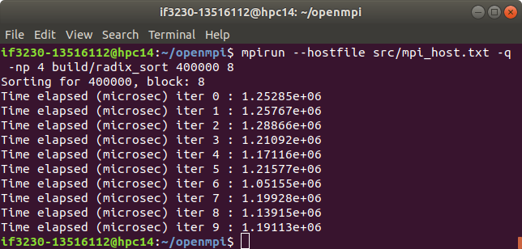 | 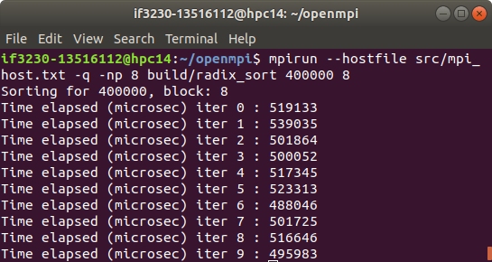 |


##### V. Analisis Perbandingan Kinerja
Setelah dilakukan pengukuran kinerja, diketahui bahwa dalam 10 iterasi, didapatkan hasil bahwa:

##### Untuk N = 400000
rata-rata waktu serial relatif lebih lambat dibandingkan waktu paralel 8 processor namun lebih cepat dibandingkan waktu paralel 4 processor. <br>

##### Untuk N = 200000
rata-rata waktu serial relatif lebih lambat dibandingkan waktu paralel 8 processor namun lebih cepat dibandingkan waktu paralel 4 processor. <br>

##### Untuk N = 100000
rata-rata waktu serial relatif lebih cepat dibandingkan waktu paralel yang menggunakan 4 atau 8 processor. <br>

##### Untuk N = 50000
rata-rata waktu serial relatif lebih cepat dibandingkan waktu paralel yang menggunakan 4 atau 8 processor. <br>

##### Untuk N = 5000
rata-rata waktu serial relatif lebih cepat dibandingkan waktu paralel yang menggunakan 4 atau 8 processor. <br>

Dapat ditarik kesimpulan Waktu yang dibutuhkan untuk menjalankan sort secara paralel lebih lama karena dalam melakukan sort, perlu membagi ke dalam thread dan perlu mengcopy data. Apabila dilakukan dalam jumlah elemen yang relatif lebih rendah, maka penggunaan program paralel tidak akan efektif, sedangkan jika jumlah elemen banyak, penambahan processor sampai angka tertentu akan mempercepat eksekusi.