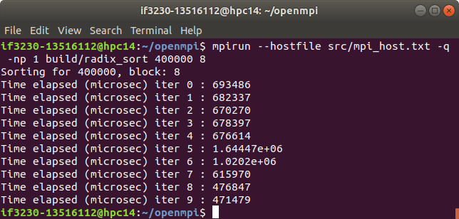
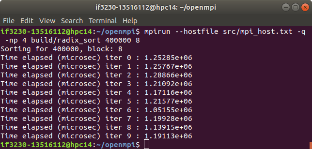
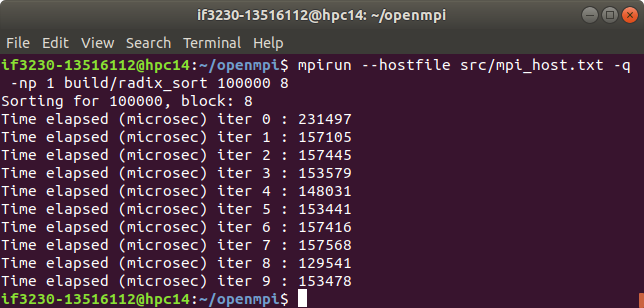
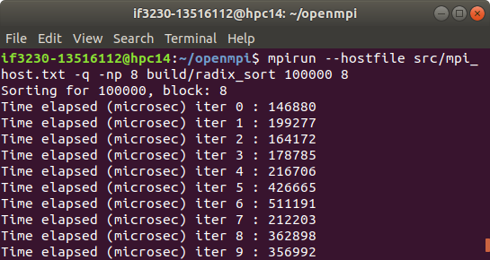
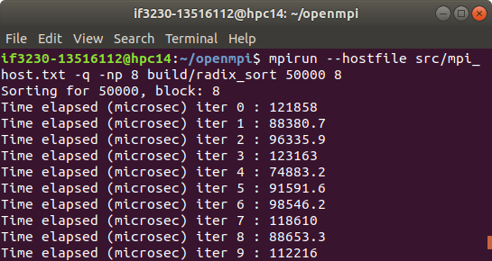
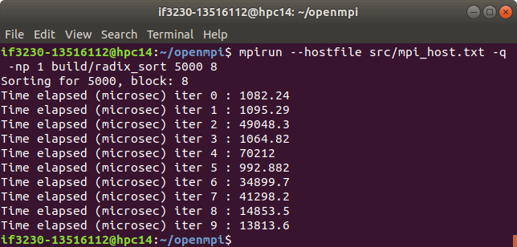
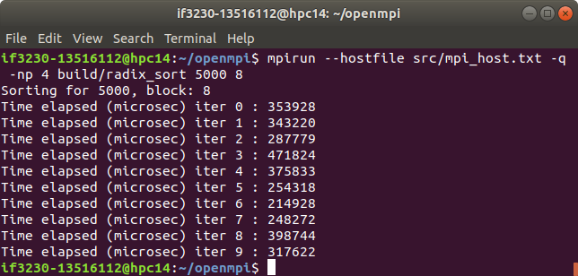

# OpenMPI - Radix Sort
## IF3230 Sistem Paralel dan Terdistribusi

Kelompok kami menggunakan sample input dengan N = 5000, 50000, 100000, 200000, 400000 dengan jumlah block B 8. Selain itu, kelompok kami juga menggunakan varian processor P 4 dan 8 karena diharapkan dapat digunakan untuk menganalisa kinerja paralelisme juga thread mana yang lebih baik digunakan.

Keterangan:
P = jumlah processor
N = jumlah elemen pada array
B = jumlah block yang digunakan

#### [Sample Input dan Output]
##### Untuk N = 400000
Serial 

Paralel dengan 4 Processor 

Paralel dengan 8 Processor 

##### Untuk N = 200000
Serial 

Paralel dengan 4 Processor 

Paralel dengan 8 Processor 

##### Untuk N = 100000
Serial 

Paralel dengan 4 Processor 

Paralel dengan 8 Processor 

##### Untuk N = 50000
Serial 

Paralel dengan 4 Processor 

Paralel dengan 8 Processor 

##### Untuk N = 5000
Serial 

Paralel dengan 4 Processor 

Paralel dengan 8 Processor 
